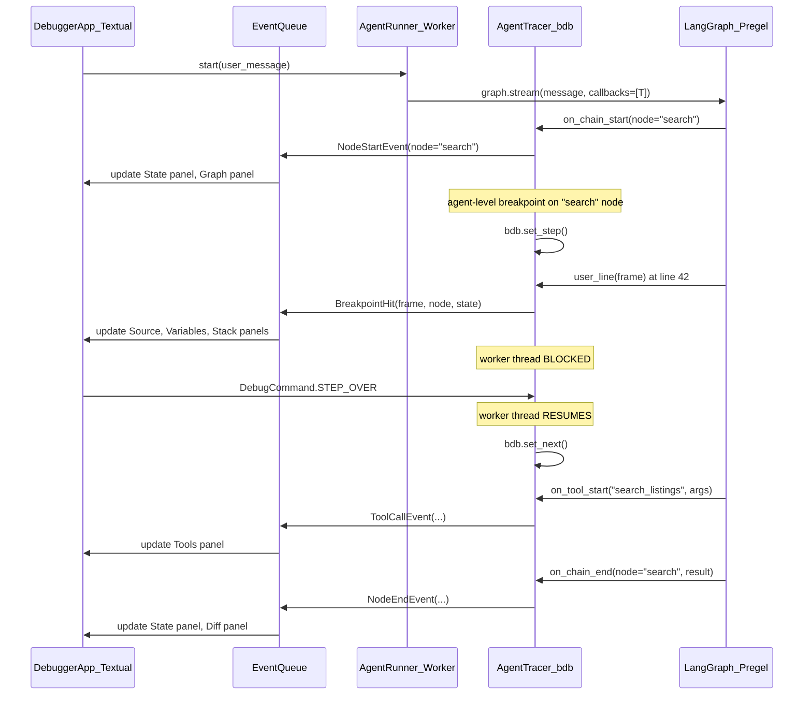
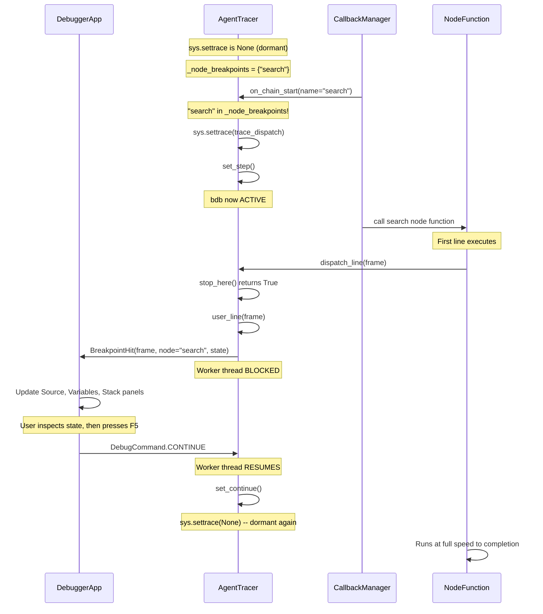

# adb: Agent Debugger for LangChain/LangGraph

## Are These Goals Orthogonal?

No -- they are **complementary layers of the same problem**. An agent developer needs to answer two kinds of questions simultaneously:

1. **Application-level** (what the gifting agent IDE does): "Which node ran? What tool was called? What did the LLM return? How did state change?"
2. **Code-level** (what pudb does): "Why did this node produce that output? What's in the local variables at line 42? Why did the conditional branch go left?"

Today you have to choose one or the other. The key insight is that LangGraph nodes are just Python functions -- when you stop at a breakpoint inside a node, you want to see *both* the Python locals *and* the graph-level context (which node, what triggered it, the full agent state). A combined debugger makes "zoom in / zoom out" seamless.

The main engineering challenge is the **event loop conflict**: `bdb.Bdb` blocks the process at breakpoints (synchronous, takes over the thread), while Textual needs its async event loop running for the UI. PuDB solves this by running urwid's event loop *inside* the bdb pause. We need an equivalent strategy for Textual.

---

## Architecture

### Threading Model

```
Main Thread (Textual event loop)        Worker Thread (agent + bdb)
┌────────────────────────────┐         ┌──────────────────────────┐
│  DebuggerApp (Textual)     │         │  AgentRunner             │
│  - renders UI              │◄═══════►│  - runs LangGraph graph  │
│  - processes user input    │  Queue  │  - AgentTracer(bdb.Bdb)  │
│  - updates panels          │         │  - pauses at breakpoints │
└────────────────────────────┘         └──────────────────────────┘
```

- **Main thread**: Textual app handles all rendering and user interaction (same pattern as the gifting agent IDE's `@work` decorator).
- **Worker thread**: The LangGraph graph runs here. An `AgentTracer(bdb.Bdb)` subclass is installed as `sys.settrace`. When a breakpoint is hit, the worker thread blocks on a `threading.Event`, waiting for the UI to signal "continue/step/next".
- **Communication**: A thread-safe queue + events bridge the two. The worker posts `DebugEvent` objects (node started, breakpoint hit, tool called, etc.) to the queue; the Textual app polls the queue and updates the UI. The UI posts `DebugCommand` objects (continue, step, set breakpoint) back.

This is the same fundamental pattern pudb uses (urwid loop runs during bdb pause), but adapted for Textual's async model.

### Core Components

```
┌─────────────────────────────────────────────────────────────────┐
│                        adb/                                      │
├─────────────────────────────────────────────────────────────────┤
│  tracer.py      - AgentTracer(bdb.Bdb) + LangGraph callbacks   │
│  app.py         - DebuggerApp(textual.App) main UI             │
│  panels/        - UI panel widgets                              │
│    source.py    - Source code view with breakpoint markers      │
│    variables.py - Variable inspector (locals/globals/watches)   │
│    stack.py     - Call stack panel                              │
│    state.py     - LangGraph state panel (from gifting IDE)      │
│    memory.py    - Agent memory panel (from gifting IDE)         │
│    tools.py     - Tool call history panel (from gifting IDE)    │
│    messages.py  - Message history panel (from gifting IDE)      │
│    graph.py     - Graph visualization (node DAG + current pos)  │
│    diff.py      - State diff panel (from gifting IDE)           │
│  events.py      - DebugEvent/DebugCommand protocol              │
│  breakpoints.py - Breakpoint manager (Python + agent-level)    │
│  runner.py      - AgentRunner (worker thread orchestrator)      │
└─────────────────────────────────────────────────────────────────┘
```

### Key Classes

**`AgentTracer(bdb.Bdb)`** -- `adb/tracer.py`

Combines Python-level tracing with LangGraph awareness:

```python
class AgentTracer(bdb.Bdb):
    """bdb-based tracer that is LangGraph-aware."""

    def __init__(self, event_queue, command_event, ...):
        super().__init__()
        self.event_queue = event_queue      # posts to UI
        self.command_event = command_event  # blocks until UI signals
        self._current_node: str | None = None
        self._graph_state: dict | None = None

    def user_line(self, frame):
        """Called at each line -- post event, block for UI command."""
        self.event_queue.put(BreakpointHit(
            frame=frame,
            node=self._current_node,
            graph_state=self._graph_state,
        ))
        cmd = self._wait_for_command()  # blocks worker thread
        # dispatch: step/next/continue/etc.

    def on_node_start(self, node_name, state):
        """LangGraph callback -- called when a graph node begins."""
        self._current_node = node_name
        self._graph_state = state
        if self._should_break_on_node(node_name):
            self.set_step()  # activate bdb tracing

    def on_tool_call(self, tool_name, args):
        """LangGraph callback -- called before tool execution."""
        self.event_queue.put(ToolCallEvent(...))
        if self._should_break_on_tool(tool_name):
            self.set_step()
```

The key trick: `AgentTracer` is both a `bdb.Bdb` for Python tracing AND a LangGraph callback handler. It bridges the two worlds by knowing which graph node is currently executing when a Python breakpoint fires.

**`DebuggerApp(textual.App)`** -- `adb/app.py`

Same Textual-based TUI as the gifting IDE, extended with code-level panels:

```python
class DebuggerApp(App):
    BINDINGS = [
        Binding("F5", "continue_exec", "Continue"),
        Binding("F10", "step_over", "Step Over"),
        Binding("F11", "step_into", "Step Into"),
        Binding("shift+F11", "step_out", "Step Out"),
        Binding("F9", "toggle_breakpoint", "Breakpoint"),
        # ... plus all the gifting IDE bindings (m/t/d/l etc.)
    ]
```

### UI Layout

Same 2-column layout as the gifting IDE (`left: 2fr`, `right: 1fr`), with Source code shown in the bottom tabs:

```
┌──────────────────────────────────────────────────────────────────┐
│ adb                                           [node: search]    │
├────────────────────────┬─────────────────────────────────────────┤
│                        │  Store / Memory                        │
│   Chat / Input         │    mom: {interests: ...}               │
│                        │    dad: {interests: ...}               │
│   > find a gift for    │                                        │
│     mom                │  State                                 │
│                        │    ▶ messages: [12]                    │
│   < Here are some      │    user_id: dkondo                     │
│     ideas...           │    current node: search                │
│                        │                                        │
│                        │  Variables (when at breakpoint)        │
│                        │    state: {...}                        │
│   [input box]          │    result: [...]                       │
│                        │  Stack (when at breakpoint)            │
│                        │    search_node:42                      │
│                        │    _run_node (runner.py)               │
├────────────────────────┴─────────────────────────────────────────┤
│ Messages │ Tools │ Source │ Diff │ Breakpoints │ Logs           │
│                                                                  │
│  ► 42 │ result = search_listings(query)                         │
│    43 │ if not result:                                          │
│    44 │     return {"error": "no results"}                      │
│    45 │ return {"listings": result}                             │
│                                                                  │
└──────────────────────────────────────────────────────────────────┘
│ F5:Continue  F9:Break  F10:Over  F11:Into  m:Msgs  s:Src q:Quit│
└──────────────────────────────────────────────────────────────────┘
```

**Layout details:**

- **Left pane (`2fr`)**: Chat log + input, identical to the gifting IDE
- **Right pane (`1fr`)**: Agent context panels, always visible:
  - Store/Memory (collapsible) -- generic Store browser or custom renderer
  - State (collapsible) -- graph state with expandable messages
  - Variables (collapsible, shown when at breakpoint) -- `frame.f_locals`
  - Stack (collapsible, shown when at breakpoint) -- call stack with frame navigation
- **Bottom tabs**: Messages, Tools, **Source**, Diff, Breakpoints, Logs
- **Auto-behavior**: When a breakpoint hits, the bottom tabs auto-switch to the Source tab and the right pane reveals the Variables/Stack collapsibles. When the user continues (F5), Variables/Stack collapse and the bottom tabs return to the previous tab.
- **Expandable bottom**: The bottom panel height can be toggled (e.g., from 12 to 20 rows) for more room when reading source code, using the same `show_bottom` reactive pattern from the gifting IDE.

### Agent-Level Breakpoints (the novel feature)

Beyond standard Python breakpoints, adb supports **semantic breakpoints**:


| Breakpoint Type          | Trigger                         | What You See                 |
| ------------------------ | ------------------------------- | ---------------------------- |
| `break node <name>`      | When graph node `<name>` starts | Graph state + node input     |
| `break tool <name>`      | When tool `<name>` is called    | Tool args + current state    |
| `break state <key>`      | When state key `<key>` changes  | Old vs new value (diff)      |
| `break transition`       | On every node transition        | Graph DAG + edge taken       |
| `break line <file:line>` | Standard Python breakpoint      | Source + locals (pudb-style) |


These are implemented by combining LangGraph callbacks (for the semantic triggers) with `bdb.set_step()` (to activate Python-level tracing at the right moment).

### Integration with LangGraph

adb hooks into LangGraph at two levels:

**1. Stream-level** (application events): Use `stream_mode=["debug", "values", "updates"]` on `graph.stream()` to receive `TaskPayload`, `TaskResultPayload`, and `CheckpointPayload` events. These feed the Messages, Tools, State, and Diff panels. Key file: `langgraph/pregel/debug.py`.

**2. Callback-level** (code tracing): Register a custom `BaseCallbackHandler` that receives `on_chain_start/end`, `on_tool_start/end`, `on_llm_start/end`. When an agent-level breakpoint fires, the callback activates `bdb.set_trace()` on the current frame, dropping into Python-level debugging. Key integration point: callbacks are passed through `RunnableConfig` to each node via `langgraph/pregel/_algo.py:prepare_single_task()`.

**3. Runner-level** (node lifecycle): The `PregelRunner.node_finished` callback (`langgraph/pregel/_runner.py:133`) fires after each node completes, providing the write results.

### Data Flow



### Where to Build This

This should be a new project at `projects/adb/` following the same structure as the gifting agent project. It would depend on `langgraph`, `langchain-core`, `textual`, and `rich` (all already in the workspace). adb should be agent-agnostic -- it takes any LangGraph `CompiledGraph` as input, not just the gifting agent.

### Entry Points

```bash
# Debug any LangGraph agent script
uv run adb run my_agent.py

# Debug with a specific graph object
uv run adb attach --graph "my_module:graph"

# Debug the gifting agent specifically
uv run adb run ../gifting_agent/gifting_agent/agent.py
```

### Summary of What Comes From Where

- **From gifting agent IDE**: Textual framework, Chat panel, Memory panel, State panel, Messages panel, Tools panel, Diff panel, Traces panel, Logs panel, slash commands, history, theming
- **From pudb**: `bdb.Bdb` subclass, Source code panel, Variables panel, Stack panel, Breakpoints panel, step/next/continue/return commands, frame navigation
- **Novel**: Agent-level breakpoints (break on node/tool/state), LangGraph callback-to-bdb bridge, unified "zoom" between application and code views, graph DAG visualization with current position

---

## Implementation Todos

1. Scaffold `projects/adb/` with `pyproject.toml`, `Makefile`, and package structure
2. Implement `events.py`: `DebugEvent` and `DebugCommand` protocol types for thread communication
3. Implement `tracer.py`: `AgentTracer(bdb.Bdb)` with LangGraph callback integration and agent-level breakpoints
4. Implement `runner.py`: `AgentRunner` worker thread that runs the graph with the tracer attached
5. Port gifting IDE panels (Memory, State, Messages, Tools, Diff, Logs) to reusable agent-agnostic widgets
6. Implement code-level panels: Source (with breakpoint markers), Variables, Stack, Breakpoints
7. Implement `app.py`: `DebuggerApp` with 3-column layout, keybindings, and event loop polling
8. Implement `breakpoints.py`: unified breakpoint manager supporting both Python and agent-level breakpoints
9. Implement CLI entry point using click (run/attach commands)
10. Write unit tests for tracer, events, breakpoints, and runner

---

## Appendix: `langgraph/pregel/debug.py` and Agent-Agnostic Design

### What `debug.py` Does

`langgraph/pregel/debug.py` is a **serialization layer** for LangGraph's `stream_mode="debug"` feature. It contains three mapper functions that convert internal Pregel execution objects into structured, JSON-serializable payloads:

1. **`map_debug_tasks(tasks)`** -- Produces `TaskPayload` events when nodes are *about to execute*. Each payload includes the task `id`, `name`, `input`, and `triggers` (which channels caused this node to fire).
2. **`map_debug_task_results(task, writes)`** -- Produces `TaskResultPayload` events when nodes *finish executing*. Each payload includes the task `id`, `name`, `error` (if any), `interrupts`, and `result` (the channel writes the node produced).
3. **`map_debug_checkpoint(config, channels, ...)`** -- Produces `CheckpointPayload` events at each checkpoint. This is a full snapshot: the current `values` (all channel state), `metadata`, `next` nodes, `tasks` with their results/errors/interrupts, and parent/child config for navigating the checkpoint tree.

These functions are called from `PregelLoop._emit()` in `_loop.py`. When `"debug"` is in the stream modes, the loop wraps each payload with a `step` number, `timestamp`, and event `type` (`"task"`, `"task_result"`, or `"checkpoint"`), then pushes it through the stream.

In short: **it is not a debugger itself -- it is the structured event feed that a debugger can consume.**

### Why the Debugger Can Be Agent-Agnostic

adb can take **any** `CompiledGraph` as input (not just the gifting agent) because `stream_mode="debug"` is part of LangGraph's public, always-available API:

1. **`"debug"` is a standard `StreamMode`** -- defined in `langgraph/types.py`:
   ```python
   StreamMode = Literal[
       "values", "updates", "checkpoints", "tasks", "debug", "messages", "custom"
   ]
   ```
2. **Works on any `CompiledGraph`** -- the `stream()` and `astream()` methods on every `CompiledGraph` (which is a `Pregel` instance) accept `stream_mode` as a parameter. No special setup or opt-in required:
   ```python
   # Works on ANY CompiledGraph
   async for mode, data in graph.astream(
       input, stream_mode=["debug", "values", "updates"]
   ):
       ...
   ```
3. **Baked into the execution loop** -- `PregelLoop._emit()` always checks for `"debug"` in `stream.modes` and emits the wrapped events. This is core Pregel infrastructure, not agent-specific code.
4. **No checkpointer required** -- while checkpoints add richer data (full state snapshots), the task/task_result events fire regardless. adb gets node lifecycle events even without a checkpointer configured.
5. **Built-in node pausing** -- the `stream()` API also supports `interrupt_before` and `interrupt_after` parameters, providing a mechanism for agent-level breakpoints (pause before/after specific nodes) without needing `bdb` for that layer.

### Key Source Files

- `langgraph/pregel/debug.py` -- Payload types (`TaskPayload`, `TaskResultPayload`, `CheckpointPayload`) and mapper functions
- `langgraph/pregel/_loop.py:_emit()` (line 876) -- Where debug events are emitted during execution
- `langgraph/types.py:StreamMode` (line 91) -- Public type defining all stream modes
- `langgraph/pregel/protocol.py:StreamProtocol` (line 151) -- The stream delivery mechanism

### Implications for Debugger Design

Because the debug stream is always available, adb's `AgentRunner` can simply call:

```python
async for chunk in graph.astream(
    input,
    config=config,
    stream_mode=["debug", "values", "updates", "messages"],
):
    mode, data = chunk
    if mode == "debug":
        if data["type"] == "task":
            # Node about to execute -- check agent-level breakpoints
        elif data["type"] == "task_result":
            # Node finished -- update state/diff panels
        elif data["type"] == "checkpoint":
            # Full state snapshot -- update all panels
    elif mode == "values":
        # Current graph state
    elif mode == "updates":
        # Delta from this node
    elif mode == "messages":
        # LLM token stream
```

No custom client wrapper (like the gifting agent's `GiftingAgentClient`) is needed. The gifting-agent-specific panels (memory, recipients) become optional plugins rather than adb core features.

---

## Appendix: Two-Tier Memory Architecture

### The Problem

The gifting agent IDE's `MemoryPanel` displays rich, domain-specific data: recipient profiles, session constraints, curated recommendations with prices and rationale. This data comes from LangGraph's **Store API** (`BaseStore`) -- a generic key-value store -- but the *namespaces*, *structure*, and *rendering* are entirely gifting-agent-specific:

```python
# Gifting agent stores data under these custom namespaces:
["etsy-gifting-agent", user_id, "recipients"]     # Recipient profiles
["etsy-gifting-agent", user_id, "session"]         # Session constraints
["etsy-gifting-agent", user_id, "ui_state"]        # Curated recommendations
["etsy-gifting-agent", user_id, "thread_summary"]  # Thread summaries
```

adb cannot know that `recipients` contains profiles with `interests` and `budget` fields, or that `ui_state` contains `curated_list.recommendations[].listing.price`. That semantic knowledge is bespoke to the gifting agent.

### Two Tiers of Agent "Memory"

Agents can have memory at two distinct levels, and adb handles each differently:

**Tier 1: Graph State (always available, fully generic)**

Every `CompiledGraph` has typed state channels. adb accesses this via:

- `stream_mode="debug"` checkpoint events (contain `values: dict[str, Any]`)
- `graph.get_state(config)` returning a `StateSnapshot` with `values`, `next`, `tasks`, etc.

This powers the **State panel** and **Diff panel** with zero agent-specific knowledge. Works for every agent.

**Tier 2: Store / Long-term Memory (optional, agent-specific content)**

The Store API (`BaseStore`) is a standard LangGraph feature, but:

- Not every agent uses a Store
- Agents that do use it define their own namespace conventions and data shapes
- The gifting IDE's `MemoryPanel` is a custom renderer for gifting-agent-specific Store content

### Solution: Generic Store Browser + Pluggable Renderers

**Default: Generic Store Browser**

When a Store is available, adb enumerates all namespaces and renders items as a collapsible JSON tree -- no knowledge of "recipients" or "session constraints" needed:

```python
class StorePanel(Static):
    """Generic Store browser -- works with any agent's Store."""

    async def refresh_store(self, store: BaseStore, namespace_prefix: tuple[str, ...]):
        items = store.search(namespace_prefix)
        # Render as collapsible tree:
        #   recipients/
        #     mom -> {name: "Mom", interests: ["gardening"], ...}
        #     dad -> {name: "Dad", interests: ["fishing"], ...}
        #   session/
        #     abc123 -> {budget: "$50", occasion: "birthday"}
```

This gives immediate visibility into any agent's long-term memory without customization.

**Optional: Pluggable MemoryRenderer**

For agents that want a richer display (like the gifting agent's recipient cards), adb accepts an optional renderer:

```python
class MemoryRenderer(Protocol):
    """Optional plugin for agent-specific memory rendering."""

    def render(self, store_items: dict[str, dict[str, Any]]) -> Text:
        """Render store items into Rich Text for the memory panel."""
        ...

# Built-in default
class GenericStoreRenderer:
    """Renders store items as a collapsible key-value JSON tree."""
    def render(self, store_items: dict[str, dict[str, Any]]) -> Text:
        ...

# Agent-specific (provided by the gifting agent, not adb)
class GiftingMemoryRenderer:
    """Renders recipients, constraints, curated recommendations."""
    def render(self, store_items: dict[str, dict[str, Any]]) -> Text:
        # Same logic as the current MemoryPanel.refresh_display()
        ...
```

adb loads the renderer at startup:

```bash
# Generic (default) -- works for any agent
uv run adb run my_agent.py

# With custom renderer
uv run adb run my_agent.py --memory-renderer "gifting_agent.renderers:GiftingMemoryRenderer"
```

### How adb Discovers the Store

adb can detect the Store from the graph's configuration:

1. **Local `CompiledGraph`**: Check `graph.store` (if the graph was compiled with `store=...`)
2. **Checkpointer config**: The Store is often passed alongside the checkpointer in `RunnableConfig`
3. **Fallback**: If no Store is found, the Memory panel simply shows "No Store configured" and only the State panel (Tier 1) is populated

### Summary


| What                     | Source                                | Generic?                                    | Panel                                            |
| ------------------------ | ------------------------------------- | ------------------------------------------- | ------------------------------------------------ |
| Graph state (channels)   | `stream_mode="debug"` / `get_state()` | Yes -- always available                     | State, Diff                                      |
| Messages                 | Graph state `messages` channel        | Yes -- standard in chat agents              | Messages                                         |
| Tool calls               | Debug stream task results + callbacks | Yes -- standard LangGraph                   | Tools                                            |
| Store / long-term memory | `BaseStore` API                       | API is generic; *content* is agent-specific | Store (generic tree) or Memory (custom renderer) |


The gifting IDE's `MemoryPanel` with recipient profiles cannot be replicated generically -- that requires knowing *what the data means*. But adb's generic Store browser provides 80% of the utility for any agent, and the renderer plugin system lets agent authors opt in to a richer display.

---

## Appendix: Tool Call Display (Fully Generic)

Unlike memory, tool calls are **fully generic** -- adb can show them for any LangGraph agent without plugins or customization.

### How the Gifting IDE Captures Tool Calls

The gifting IDE uses two data sources, both based on standard LangChain message types:

1. **During streaming** -- AI messages in the `values` stream contain `tool_calls` (name, args, id). Each new tool call ID is yielded as a `ToolCall` event and tracked in `_tool_call_results`.
2. **After completion** -- Tool results are backfilled by walking the state's `messages` list and matching `ToolMessage` entries (type `"tool"`) back to their `tool_call_id`. This attaches result content, errors, and `duration_ms` from metadata.

The `ToolCallsPanel` then renders each call as: `[index] name`, `args` (with empty values filtered), `result` (truncated to 100 chars), `error`, and `duration`.

### Why This Is Already Agent-Agnostic

Both data sources use **standard `langchain-core` message types**:

- `AIMessage.tool_calls` -- every LangChain chat model produces these when the LLM invokes a tool. The format (`name`, `args`, `id`) is defined in `langchain-core`, not by any specific agent.
- `ToolMessage` -- every tool execution produces one, with `tool_call_id`, `content` (the result), and optional error info.

These exist in the `messages` channel of any agent using `MessagesState`, which is the standard pattern for LangGraph chat agents.

### How adb Will Capture Tool Calls

adb has three generic sources:

**Source 1: `stream_mode="messages"`** -- Streams individual messages as they're produced, including AI messages with `tool_calls` and `ToolMessage` results. Gives real-time tool call events without waiting for a node to finish.

**Source 2: Debug stream `task_result` events** -- When a tool-calling node finishes, the `TaskResultPayload` contains the node's writes to the `messages` channel, which include both the AI tool call messages and tool result messages.

**Source 3: Graph state `messages` channel** -- After any step, `graph.get_state(config).values["messages"]` contains the full message history. adb walks it to extract tool calls and match results, identical to the gifting client's `_update_tool_results_from_state` logic.

### adb Tool Call Data Model

```python
@dataclass
class ToolCallRecord:
    """A tool call extracted from standard LangChain messages.
    Works for any LangGraph agent."""

    name: str
    args: dict[str, Any]
    tool_call_id: str
    result: Any = None
    error: str | None = None
    duration_ms: float = 0.0
    node: str | None = None   # Which graph node made this call (from debug stream)
    step: int | None = None   # Which graph step number


def extract_tool_calls(messages: list) -> list[ToolCallRecord]:
    """Extract tool calls from standard LangChain messages."""
    records: list[ToolCallRecord] = []
    id_to_record: dict[str, ToolCallRecord] = {}

    for msg in messages:
        if msg.get("type") == "ai" and msg.get("tool_calls"):
            for tc in msg["tool_calls"]:
                record = ToolCallRecord(
                    name=tc["name"],
                    args=tc.get("args", {}),
                    tool_call_id=tc["id"],
                )
                records.append(record)
                id_to_record[tc["id"]] = record
        elif msg.get("type") == "tool":
            tc_id = msg.get("tool_call_id")
            if tc_id in id_to_record:
                rec = id_to_record[tc_id]
                rec.result = msg.get("content")
                rec.error = msg.get("error")
                metadata = msg.get("metadata", {})
                if isinstance(metadata, dict):
                    duration = metadata.get("duration_ms")
                    if isinstance(duration, (int, float)):
                        rec.duration_ms = float(duration)

    return records
```

### Enhancements Over the Gifting IDE

adb's tool call display adds two things the gifting IDE doesn't have:

- **Node attribution**: Each tool call is annotated with which graph node triggered it (from the debug stream's `task` events). This is useful for agents with multiple tool-calling nodes.
- **Step number**: Each tool call is tagged with the graph step it occurred in, making it easy to correlate with state diffs and checkpoints.

The `ToolCallsPanel` rendering will be nearly identical to the gifting IDE's -- name, args, result, error, duration -- since the underlying data model is the same standard LangChain message format.

---

## Appendix: Message Display (Fully Generic)

Like tool calls, messages are **fully generic** -- the gifting IDE's message rendering contains zero agent-specific code and can be ported to adb essentially unchanged.

### How the Gifting IDE Shows Messages

The gifting IDE has **two views** of messages:

**StatePanel (right sidebar)** -- Compact, expandable summary:

- Shows message count with a click-to-toggle indicator: `"▶ messages: [24] (click to toggle)"`
- When expanded, lists each message in reverse order with type-colored labels:
  - `human` (green): truncated content preview
  - `ai` (cyan): truncated content, or tool call names if present
  - `tool` (yellow): tool name only
  - `system` (red): just `"system"`
- Also shows `user_id` and truncated `thread_id` from state values

**MessagesPanel (bottom tab)** -- Full chronological history:

- Groups messages by user input with section headers: `'Messages after user #3: "find a gift for..."'`
- `human`: full content in green, prefixed with `$`
- `ai` with tool calls: `> tool_name({args})` in dim for each call
- `ai` with text: full content in cyan
- `tool`: `[tool_name]: returned` in yellow
- `system`: `[system prompt]` in dim red

### Why This Is Already Agent-Agnostic

Both panels work exclusively with the standard `messages` list from graph state values. They only branch on message `type` (`human`, `ai`, `tool`, `system`) and read standard fields (`content`, `tool_calls`, `name`). These are the serialized forms of `langchain-core` message types (`HumanMessage`, `AIMessage`, `ToolMessage`, `SystemMessage`) -- universal across all LangGraph agents.

The data source is generic: any agent using `MessagesState` (the standard LangGraph chat pattern) has a `messages` channel accessible via `graph.get_state(config).values["messages"]`.

### How adb Will Show Messages

adb ports both panels with minimal changes:

**StatePanel** -- Identical logic. Reads `values["messages"]` from either `get_state()` or the debug stream's checkpoint `values` payload. The compact expandable format works for any agent.

**MessagesPanel** -- Identical logic. The grouping-by-user-input pattern (incrementing `user_count` on each `human` message, printing a section header) is a generic rendering choice.

Data sources for adb:

- **`stream_mode="messages"`**: Real-time message streaming as they're produced
- **Debug stream checkpoint events**: `CheckpointPayload.values` contains the full messages list at each checkpoint
- **`graph.get_state(config).values["messages"]`**: Full message history after any step

### Enhancement Over the Gifting IDE

adb adds **step annotation**: messages can be tagged with the graph step number they were produced in (from the debug stream's `task` events), making it easy to correlate messages with node execution, state diffs, and checkpoints.

### Summary of Panel Portability


| Panel                         | Agent-specific code?                                        | Portability                                                  |
| ----------------------------- | ----------------------------------------------------------- | ------------------------------------------------------------ |
| StatePanel (messages summary) | None                                                        | Direct port                                                  |
| MessagesPanel (full history)  | None                                                        | Direct port                                                  |
| ToolCallsPanel                | None                                                        | Direct port + node/step annotation                           |
| MemoryPanel                   | Entirely agent-specific (recipients, session, curated recs) | Replaced by generic Store browser + optional renderer plugin |
| DiffPanel                     | None (uses DeepDiff on state values)                        | Direct port                                                  |
| TracesPanel                   | None (LangSmith URLs from run IDs)                          | Direct port                                                  |
| LogsPanel                     | None (generic debug log)                                    | Direct port                                                  |


Of the seven panels in the gifting IDE, **six port directly** with no changes. Only the `MemoryPanel` requires the two-tier approach (generic Store browser + optional renderer) described in the memory appendix.

---

## Appendix: `import adb; adb.set_trace()` Support

### Overview

When adb is launched via `adb run`, the Textual UI is already running in the main thread and the `AgentTracer(bdb.Bdb)` singleton already exists. In this mode, `import adb; adb.set_trace()` is trivial to support -- it's a thin wrapper around `bdb.Bdb.set_trace()`.

### How pudb Does It

1. `pudb/__init__.py` exposes a module-level `set_trace()` function
2. It gets-or-creates a singleton `Debugger(bdb.Bdb)` via `_get_debugger()`
3. It calls `dbg.set_trace(sys._getframe().f_back)` -- passing the **caller's frame** so the debugger stops at the line after the `set_trace()` call, not inside the debugger itself
4. `Debugger.set_trace()` installs `self.trace_dispatch` on every frame in the stack via `frame.f_trace`, then calls `sys.settrace(self.trace_dispatch)` to activate tracing

### How adb Will Do It

The `adb` package exposes the same API:

```python
# adb/__init__.py

import sys

_tracer: "AgentTracer | None" = None


def set_trace(paused: bool = True) -> None:
    """Drop into the agent debugger at this point.

    Usage:
        import adb; adb.set_trace()

    Requires adb to be running (launched via `adb run`).
    """
    global _tracer
    if _tracer is None:
        from adb.tracer import AgentTracer
        _tracer = AgentTracer.get_current()
        if _tracer is None:
            raise RuntimeError(
                "No adb debugger is running. "
                "Launch your agent with: adb run <script.py>"
            )

    frame = sys._getframe().f_back
    _tracer.set_trace(frame, paused=paused)
```

Since `AgentTracer` inherits from `bdb.Bdb`, it gets `set_trace()` for free -- `bdb.Bdb.set_trace()` handles the frame walking and `sys.settrace` installation. The only addition is that `AgentTracer.user_line()` posts a `BreakpointHit` event to the UI queue and blocks the worker thread until the user issues a continue/step/next command from the Textual UI.

### `PYTHONBREAKPOINT` Support

When launched via `adb run`, adb sets `sys.breakpointhook = adb.set_trace` at startup. This means users can use Python's built-in `breakpoint()` and it will drop into adb:

```python
# In any agent node code:
def my_node(state: AgentState) -> dict:
    results = search(state.query)
    breakpoint()  # drops into adb when running under `adb run`
    return {"results": results}
```

Or from the command line:

```bash
PYTHONBREAKPOINT=adb.set_trace adb run my_agent.py
```

### What Happens at the Breakpoint

When `set_trace()` fires inside agent code running in the worker thread:

1. `bdb.Bdb.set_trace()` installs tracing on the call stack
2. `AgentTracer.user_line()` fires at the next line
3. The tracer posts a `BreakpointHit` event to the UI queue (includes the frame, current graph node, graph state)
4. The worker thread **blocks** on a `threading.Event`
5. The Textual UI (main thread) receives the event, updates the Source, Variables, and Stack panels
6. The user issues a command (F5 Continue, F10 Step Over, etc.)
7. The UI signals the `threading.Event`, the worker thread resumes

---

## Appendix: How Agent-Level Breakpoints Work (bdb + LangGraph Callbacks)

This section explains the core mechanism behind semantic breakpoints like `break node search` -- how a LangGraph callback triggers Python-level line tracing inside a node function.

### Background: How bdb Tracing Works

Python's `bdb.Bdb` relies on `sys.settrace()` -- a hook that makes the interpreter call a trace function on every line, function call, and return. This is expensive, so bdb has modes to control when it actually stops:

- **`set_step()`**: Sets `stopframe = None`, meaning "stop at the very next line, in any frame." Most aggressive mode.
- **`set_next(frame)`**: Sets `stopframe = frame`, meaning "stop at the next line, but only in this specific frame" (step over).
- **`set_continue()`**: Sets `stoplineno = -1`, meaning "don't stop unless there's a breakpoint." If no breakpoints exist, it calls `sys.settrace(None)` to **remove tracing entirely** for zero overhead.

On every line execution, `dispatch_line()` checks `stop_here(frame)` -- which compares the current frame against `stopframe`. If it matches (or `stopframe is None` for step mode), it calls `user_line(frame)`, which is the override point.

### The Key Insight

When adb is in **continue mode** (no Python breakpoints set), `sys.settrace` is `None` -- there is **zero tracing overhead**. The agent runs at full speed. bdb is dormant.

When a LangGraph callback fires (a semantic event), the callback code runs **in the same thread** as the node function. At that moment, the callback can **wake up bdb** by calling `set_step()` and reinstalling `sys.settrace(self.trace_dispatch)`. From that point forward, bdb is active and will call `user_line()` on the very next line of code.

### Step-by-Step: `break node search`

Here's what happens when the user sets an agent-level breakpoint on a node called "search":

**Step 1: User sets the breakpoint in the UI:**

```
/break node search
```

This registers `"search"` in the tracer's `_node_breakpoints` set. bdb stays dormant -- `sys.settrace` is `None`, zero overhead.

**Step 2: LangGraph executes the graph. The "search" node is about to run.**

Inside `RunnableCallable.invoke()`, the callback manager fires `on_chain_start()` **before** calling the node function. This happens in the worker thread:

```python
# langgraph/_internal/_runnable.py (line 376-393)
callback_manager.on_chain_start(None, input, name="search", ...)
try:
    ret = context.run(self.func, *args, **kwargs)  # <-- node function runs here
```

**Step 3: The `AgentTracer`'s callback handler receives `on_chain_start`:**

```python
class AgentTracer(bdb.Bdb, BaseCallbackHandler):

    def on_chain_start(self, serialized, inputs, *, run_id, name, **kwargs):
        """LangGraph callback -- fires in the same thread as the node."""
        self._current_node = name

        if name in self._node_breakpoints:
            # ACTIVATE bdb tracing right now.
            # The next line of Python code will trigger user_line().
            sys.settrace(self.trace_dispatch)
            self.set_step()
```

The critical calls:

- `sys.settrace(self.trace_dispatch)` -- reinstalls the trace function on the current thread
- `self.set_step()` -- sets `stopframe = None, stoplineno = 0`, telling bdb "stop at the very next line"

**Step 4: Control returns to `RunnableCallable.invoke()`, which calls the node function:**

```python
ret = context.run(self.func, *args, **kwargs)  # self.func is the "search" node
```

Because `sys.settrace` is now active and `set_step()` was called, the interpreter calls `dispatch_line()` on the **first line** of the search node function.

**Step 5: `dispatch_line()` calls `stop_here()`, which returns `True`** (because `stopframe is None` after `set_step()`).

**Step 6: `dispatch_line()` calls `user_line(frame)` -- our override:**

```python
def user_line(self, frame):
    """Called when bdb stops at a line."""
    # Post the breakpoint hit to the UI, including graph context
    self.event_queue.put(BreakpointHit(
        frame=frame,
        filename=frame.f_code.co_filename,
        lineno=frame.f_lineno,
        locals=frame.f_locals,
        node=self._current_node,       # "search"
        graph_state=self._graph_state,  # current LangGraph state
    ))

    # Block the worker thread until the UI sends a command
    cmd = self._wait_for_command()  # blocks on threading.Event

    # Dispatch the user's command
    if cmd == DebugCommand.CONTINUE:
        self.set_continue()   # removes tracing, runs at full speed
    elif cmd == DebugCommand.STEP_OVER:
        self.set_next(frame)  # stop at next line in this frame
    elif cmd == DebugCommand.STEP_INTO:
        self.set_step()       # stop at very next line, any frame
    elif cmd == DebugCommand.STEP_OUT:
        self.set_return(frame) # stop when this frame returns
```

**Step 7: The user is now debugging inside the search node.** The Source panel shows the node's Python code with the current line highlighted. The Variables panel shows `frame.f_locals`. The State panel shows the LangGraph graph state. They can step through code, inspect variables, then hit Continue to resume full-speed execution.

### How `break tool` Works (Same Mechanism, Different Trigger)

For `break tool search_listings`, the tracer registers a tool breakpoint. The `on_tool_start` callback fires when a tool is about to execute -- in the same thread, before the tool function runs:

```python
def on_tool_start(self, serialized, input_str, *, name, **kwargs):
    if name in self._tool_breakpoints:
        sys.settrace(self.trace_dispatch)
        self.set_step()
```

This causes bdb to stop at the first line inside the tool function.

### How `break state <key>` Works (Post-Execution Check)

For state breakpoints, the tracer checks after each node completes (via `on_chain_end`) whether a watched state key changed:

```python
def on_chain_end(self, outputs, *, name, **kwargs):
    if self._state_breakpoints:
        new_state = self._get_current_state()
        for key in self._state_breakpoints:
            if new_state.get(key) != self._previous_state.get(key):
                # State changed -- activate tracing at the return point
                sys.settrace(self.trace_dispatch)
                self.set_step()
                break
        self._previous_state = new_state
```

### The Zero-Overhead Property

This design has a crucial performance property: **when no agent-level breakpoints match and no Python breakpoints are set, `sys.settrace` is `None`.** The agent runs at full speed with zero tracing overhead. bdb only activates at the precise moment a semantic breakpoint fires, and deactivates again when the user hits Continue (`set_continue()` calls `sys.settrace(None)` when no breakpoints remain).

This is the same optimization that stdlib `bdb` uses -- the trace function is only installed when actively stepping, and removed as soon as adb resumes free-running execution.

### Sequence Diagram



---

## Appendix: LangGraph `interrupt_before`/`interrupt_after` vs bdb

### How Interrupts Work

LangGraph's `interrupt_before`/`interrupt_after` is a built-in mechanism for pausing graph execution at node boundaries. At the start of `PregelLoop.tick()` (before node execution) and in `after_tick()` (after), the loop checks `should_interrupt()`. If a matching node is about to run or just finished, it raises `GraphInterrupt`, ending the `stream()`/`invoke()` call. State is saved to the checkpointer. To resume, you call `invoke(None, config)` which loads from the checkpoint and continues.

These can be set **dynamically per invocation**, not just at compile time:

```python
# Per-invocation interrupts (no recompilation needed)
async for chunk in graph.astream(
    inputs, config,
    interrupt_before=["agent"],
    interrupt_after=["tools"],
):
    ...

# Inspect state after interrupt
state = graph.get_state(config)

# Optionally modify state before resuming
graph.update_state(config, {"messages": [...]})

# Resume from checkpoint
result = graph.invoke(None, config)
```

Key properties:

- **Requires a checkpointer** -- state must be persisted to resume
- **Per-invocation** -- can be passed dynamically, not just at compile time
- **Node-level granularity only** -- pauses before/after entire nodes, cannot stop mid-node
- **Ends the stream call** -- the `async for` loop terminates; a new `invoke()` resumes
- **Full state inspection** -- provides a `StateSnapshot` with all channel values and pending tasks
- **State modification** -- `update_state()` lets you change channel values before resuming

### Comparison with bdb-Based Approach


| Capability                        | `interrupt_before/after` | bdb-based (plan)           |
| --------------------------------- | ------------------------ | -------------------------- |
| Break before/after a node         | Yes                      | Yes                        |
| Break mid-node (line level)       | No                       | Yes                        |
| Break on tool call                | No                       | Yes                        |
| Break on state key change         | No                       | Yes                        |
| Step through code line-by-line    | No                       | Yes                        |
| Inspect Python locals/stack       | No                       | Yes                        |
| Inspect graph state               | Yes                      | Yes                        |
| Zero overhead when not breaking   | Yes (no tracing)         | Yes (`sys.settrace(None)`) |
| Requires checkpointer             | Yes                      | No                         |
| Works with remote/deployed graphs | Yes                      | No (needs same process)    |
| Modify state before resuming      | Yes (`update_state()`)   | Not directly               |


### Where Interrupts Shine That bdb Doesn't

The one thing interrupts can do that the bdb approach cannot easily replicate is **modify state before resuming**. After an interrupt, you can call `graph.update_state(config, new_values)` to change channel values before continuing. This is powerful for "what-if" debugging -- e.g., manually editing the messages list or injecting a different tool result.

The bdb approach pauses the thread mid-execution, so the state is in-flight and not checkpointed. You can inspect `frame.f_locals` but modifying graph state cleanly mid-node is tricky.

### Potential Hybrid Approach (Future Consideration)

The two mechanisms could be combined so adb uses the best tool for each job:

1. **`break node search` (no code stepping needed)**: Use `interrupt_before=["search"]` on the `astream()` call. When the interrupt fires, state is checkpointed, and the UI shows the full `StateSnapshot`. The user can inspect and modify state, then resume with `invoke(None, config)`. No `sys.settrace` needed.
2. **`break node search` then "step into"**: Start with the interrupt approach. If the user presses F11 (Step Into), activate bdb tracing and resume with `invoke(None, config)` + `sys.settrace` installed. Clean state inspection via interrupts, followed by line-level debugging via bdb.
3. **`break tool` / `break state` / `break line`**: These require bdb because they need finer granularity than whole-node pausing.

This hybrid would give clean state inspection and modification via interrupts at the node level, with the ability to "zoom in" to code-level debugging via bdb when needed. However, it adds complexity to the execution model (managing the checkpoint lifecycle, handling the stream restart on resume) and is noted here for future consideration rather than initial implementation.

---

## Appendix: Why adb Uses Sync `stream()` Instead of Async `astream()`

### The Problem

`sys.settrace` -- the CPython hook that `bdb.Bdb` relies on for breakpoints and stepping -- is **per-thread**. When LangGraph's `astream()` (async) runs sync node functions, it dispatches them to a thread pool executor (a different thread). The trace function installed in the main worker thread never fires for code executing in the pool thread, so breakpoints don't work.

### The Solution

adb uses `graph.stream()` (sync) instead of `graph.astream()`. Since the runner already executes in its own dedicated worker thread, there is no need for async. Sync stream keeps all node execution in the same thread where `sys.settrace` is installed.

### What We Lose

- **Parallel node execution**: LangGraph's `PregelRunner` can run multiple independent nodes concurrently via a thread pool with `astream()`. With sync `stream()`, parallel nodes execute sequentially. In practice most agent graphs are linear (agent -> tools -> agent -> ...), so this rarely matters.
- **Native async concurrency**: If the agent has `async def` node functions, `stream()` wraps them internally via `asyncio.run()`. They work, but without async concurrency benefits.

### What We Keep

- `sys.settrace` works correctly -- breakpoints land in user code
- All stream modes (`debug`, `values`, `updates`) work identically
- All callbacks fire the same way
- The graph produces the same results

### Why This Is Acceptable

This is the same tradeoff pudb makes -- pudb traces one thread at a time and cannot debug across threads. For a debugger, deterministic single-threaded execution is a feature, not a limitation. You don't want breakpoints firing simultaneously in parallel node threads -- that would make the debugging experience confusing and non-deterministic.

### Future Alternative

If parallel node debugging becomes necessary, the alternatives would be:
- `threading.settrace()` -- applies the trace function to all new threads, but thread pool threads are already created
- Monkey-patching LangGraph's executor to install the trace on worker threads -- fragile and coupled to LangGraph internals
- Using `interrupt_before`/`interrupt_after` for node-level pausing (no bdb needed) with bdb only for code-level stepping within a single node

These are noted for future consideration.

---

## Appendix: Message `type` vs `role` Keys

LangChain messages have two representations, and adb must handle both:

1. **LangChain Message objects** (`HumanMessage`, `AIMessage`, etc.) -- use `type` as the discriminator field. `msg.type` returns `"human"`, `"ai"`, `"tool"`, `"system"`.

2. **Raw dicts** (OpenAI-style format) -- use `role`. E.g., `{"role": "ai", "content": "..."}` has no `type` key.

LangGraph's channel system usually converts raw dicts into proper Message objects, so by the time they're in graph state they typically have `type`. But there are edge cases (e.g., simple agents returning raw dicts) where `role` is the only key present.

adb uses a fallback pattern everywhere it reads message types:

```python
msg_type = msg.get("type") or msg.get("role") or "unknown"
```

This handles both representations correctly for any LangGraph agent. It is not agent-specific -- it's a LangChain convention. The following files use this pattern:

- `adb/runner.py` -- response extraction from stream chunks
- `adb/panels/state.py` -- message summary in the State panel
- `adb/panels/messages.py` -- full message history rendering
